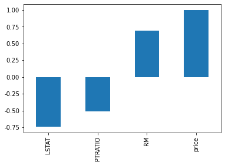
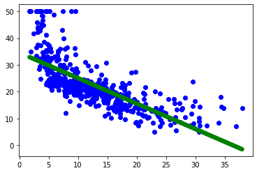

```python
import pandas as pd
from sklearn import datasets

# v_housing是一个sklearn.utils.Bunch对象
v_housing = datasets.load_boston()
# 创建pandas数据结构DataFrame（表格）
data = pd.DataFrame(v_housing.data, columns=v_housing.feature_names) 
data['price'] = v_housing.target

'''
Bunch本质上的数据类型是dict，属性有：

DESCR：数据集描述
feature_names：特征名，可自定义（有些数据集可能为target_names）
filenames：数据集的文件名
target：数据集的目标分类或目标值
data：数据内容
'''
print(data.head(10))

```

          CRIM    ZN  INDUS  CHAS    NOX     RM    AGE     DIS  RAD    TAX  \
    0  0.00632  18.0   2.31   0.0  0.538  6.575   65.2  4.0900  1.0  296.0   
    1  0.02731   0.0   7.07   0.0  0.469  6.421   78.9  4.9671  2.0  242.0   
    2  0.02729   0.0   7.07   0.0  0.469  7.185   61.1  4.9671  2.0  242.0   
    3  0.03237   0.0   2.18   0.0  0.458  6.998   45.8  6.0622  3.0  222.0   
    4  0.06905   0.0   2.18   0.0  0.458  7.147   54.2  6.0622  3.0  222.0   
    5  0.02985   0.0   2.18   0.0  0.458  6.430   58.7  6.0622  3.0  222.0   
    6  0.08829  12.5   7.87   0.0  0.524  6.012   66.6  5.5605  5.0  311.0   
    7  0.14455  12.5   7.87   0.0  0.524  6.172   96.1  5.9505  5.0  311.0   
    8  0.21124  12.5   7.87   0.0  0.524  5.631  100.0  6.0821  5.0  311.0   
    9  0.17004  12.5   7.87   0.0  0.524  6.004   85.9  6.5921  5.0  311.0   
    
       PTRATIO       B  LSTAT  price  
    0     15.3  396.90   4.98   24.0  
    1     17.8  396.90   9.14   21.6  
    2     17.8  392.83   4.03   34.7  
    3     18.7  394.63   2.94   33.4  
    4     18.7  396.90   5.33   36.2  
    5     18.7  394.12   5.21   28.7  
    6     15.2  395.60  12.43   22.9  
    7     15.2  396.90  19.15   27.1  
    8     15.2  386.63  29.93   16.5  
    9     15.2  386.71  17.10   18.9  
    


```python
import matplotlib.pyplot as plt
import pandas as pd
from sklearn import datasets

v_housing = datasets.load_boston()
data = pd.DataFrame(v_housing.data, columns=v_housing.feature_names)
data['price'] = v_housing.target
corr = data.corr()  # 默认参数pearson：Pearson相关系数来衡量两个数据集合是否在一条线上面，即针对线性数据的相关系数计算，针对非线性可添加参数method='spearman'
corr = corr['price']# 输出每个特征和price的相关系数
print(corr)  
corr[abs(corr) > 0.5].sort_values().plot.bar()  # 将相关系数的绝对值大于0.5的特征画图显示出来
plt.show()
```

    CRIM      -0.388305
    ZN         0.360445
    INDUS     -0.483725
    CHAS       0.175260
    NOX       -0.427321
    RM         0.695360
    AGE       -0.376955
    DIS        0.249929
    RAD       -0.381626
    TAX       -0.468536
    PTRATIO   -0.507787
    B          0.333461
    LSTAT     -0.737663
    price      1.000000
    Name: price, dtype: float64
    





```python
import numpy as np
import matplotlib.pyplot as plt
import pandas as pd
from sklearn.model_selection import train_test_split
from sklearn.linear_model import LinearRegression
from sklearn import metrics
from sklearn import datasets

v_housing = datasets.load_boston()
# 只考虑第12列特征LSTAT对价格的影响
x = v_housing.data[:, np.newaxis, 12]
y = v_housing.target
lm = LinearRegression()
lm.fit(x, y)
plt.scatter(x, y, color='blue')
plt.plot(x, lm.predict(x), color='green', linewidth=6)
plt.show()
# 可见，有较为明显的线性关系
```





```python
import numpy as np
import matplotlib.pyplot as plt
import pandas as pd
from sklearn.model_selection import train_test_split
from sklearn.linear_model import LinearRegression
from sklearn import metrics
from sklearn import datasets

v_housing = datasets.load_boston()
data = pd.DataFrame(v_housing.data, columns=v_housing.feature_names)
data['price'] = v_housing.target
data = data[['LSTAT', 'PTRATIO', 'RM', 'price']]  # 只挑选相关性最强的三个特征

y = np.array(data['price'])
data = data.drop(['price'], axis=1)
x = np.array(data)
train_X, test_X, train_Y, test_Y = train_test_split(x,y,test_size=0.2)  
# 分割训练集和测试集
linreg = LinearRegression()
linreg.fit(train_X, train_Y)  # 测试线性回归模型
print('预测性能得分:', linreg.score(x,y))
'''
LinearRegression().score返回的是决定系数R²

    R² = (1-u/v)
    u=((y_true - y_pred) ** 2).sum()
    v=((y_true - y_true.mean()) ** 2).sum()

    其中y_pred已经在score方法中通过predict()方法得到，再与y_true进行比对
    所以y_true和y_pred越接近，u/v的值越小，R²越接近1
'''
print('w:', linreg.coef_)
print('b:', linreg.intercept_)
y_predict = linreg.predict(test_X)  # 预测数据集
print(metrics.mean_squared_error(y_predict, test_Y)) # 计算预测误差
```

    预测性能得分: 0.6784128261082099
    w: [-0.59394178 -0.92502078  4.43650122]
    b: 19.200644408092348
    26.496280352427167
    
